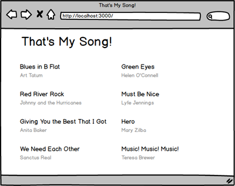
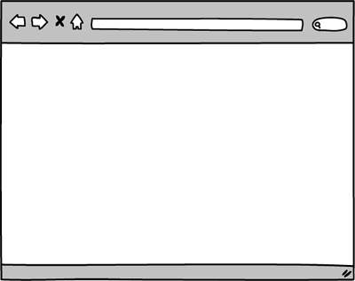

# Test-driven Development: Favorite Songs

## Summary
This challenge assumes that we're—if not comfortable—at least familiar with testing a Rails application (see [rock-paper-scissors challenge][]).  In this challenge, we'll build a Rails application feature-by-feature, taking an [outside-in][thoughtbot outside-in testing] approach to testing:  for each new feature, we'll begin by writing a feature test which will lead us to write further tests as it drives our development (e.g., unit tests for our models).

## Releases
### Release 0: Set up a New Application for Testing
Our first step is to create a new Rails application and set it up for testing.  Begin by generating a new Rails app, but pass on some of the default options: (1) use a Postgres database, (2) skip Test Unit as we'll be testing with RSpec.  Then, set up the application to test with RSpec, using the [rspec-rails][] gem.  And, finally, add [Capybara][] for feature testing.

*Note:* Instructions for incorporating rspec-rails and capybara are found in each gem's repository's readme.

### Release 1: List Songs on the Homepage
Our application is going to allow users to create a collection of their favorite songs.  Instead of attempting to build everything all at once, lets start with a simple feature:  visiting the homepage and seeing a list of songs (see Figure 1 for an example).

Remember, the focus of this challenge is the process of test-driven development for a Rails application, not simply building the required functionality.  Begin by writing a feature test.  What might such a test look like?  Well, let's say we have a few songs in our database.  Then, when a user visits the homepage, each of the songs is represented on the page.

  
*Figure 1*. Listing songs on the homepage.

### Release 2: User Registration, Log In, and Log Out
As stated in *Release 1*, our application is going to allow users to create a collection of their favorite songs. We have songs.  Now we need users.  Write feature tests that describe registering a new account, logging in, and logging out; the mockup in Figure 2 shows an example registration workflow.

  
*Figure 2*. Example registration flow.

[capybara]: https://github.com/jnicklas/capybara
[rock-paper-scissors challenge]: ../../../rocket-paperplane-scissors-challenge
[rspec-rails]: https://github.com/rspec/rspec-rails
[thoughtbot outside-in testing]: https://robots.thoughtbot.com/testing-from-the-outsidein
